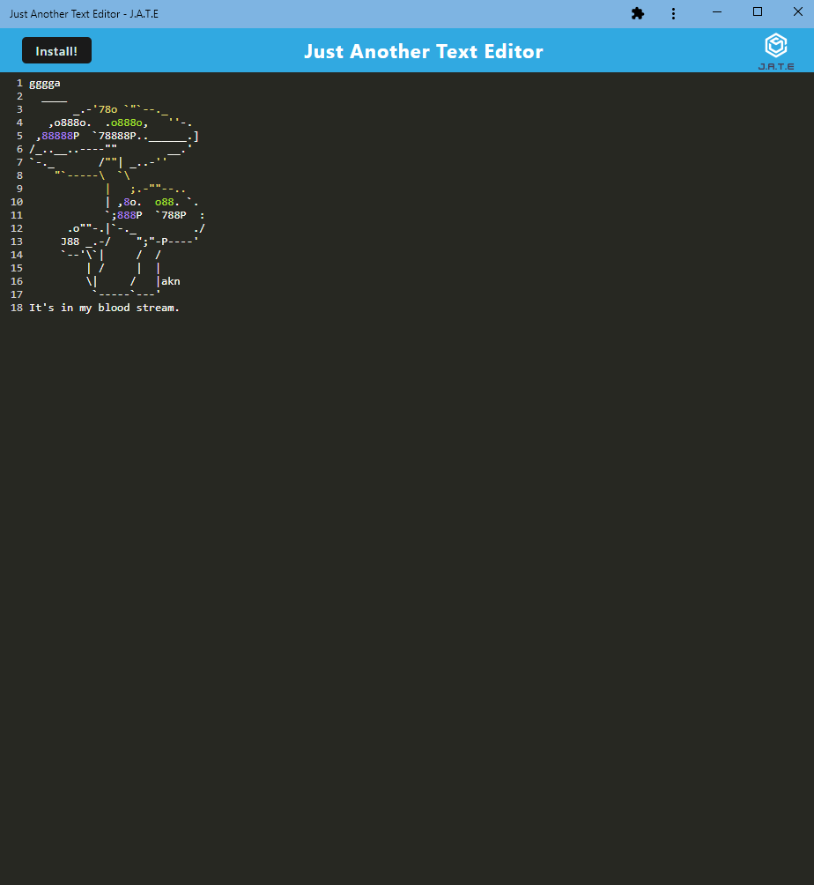

# Text-Editor

Module 19. Service Workers and downloadable PWA's. 

## Table of Contents

- [Installation](#installation)
- [Usage](#usage)
- [Support](#support)
- [Contributing](#contributing)

## Installation

The application is deployed at https://jate-pwa-demo-1b15bf050958.herokuapp.com/. From there you can install it locally if you are in a chromium-based browser. Firefox no longer supports downloadable PWAs. 
To run this locally clone the repo, npm i, and either use npm start and go to localhost:3000 or use npm run start:dev to run the development server and not the build. 
If you run it locally you may have to run 
` npm install --save-dev @babel/plugin-proposal-object-rest-spread `
because npm i does not install that dev dependancy for some users for unknown reasons.

## Usage

What you type is saved. The application has a service worker. You can install the application to your machine locally to be run offline. Uses indexedDB. Static images and css are cached. 
Changes to the wordpad are saved when you click out of the dom or scroll. Changes to the downloaded application are shown when the site is loaded in browser even if the browser is different (ex: type in chrome, download app, changes shown in app when opened, make change, open page in firefox, changes shown in that browser.)

[Deployed App](https://jate-pwa-demo-1b15bf050958.herokuapp.com/): https://jate-pwa-demo-1b15bf050958.herokuapp.com/
[Repo](https://github.com/LaurenWollaston/Text-Editor)

